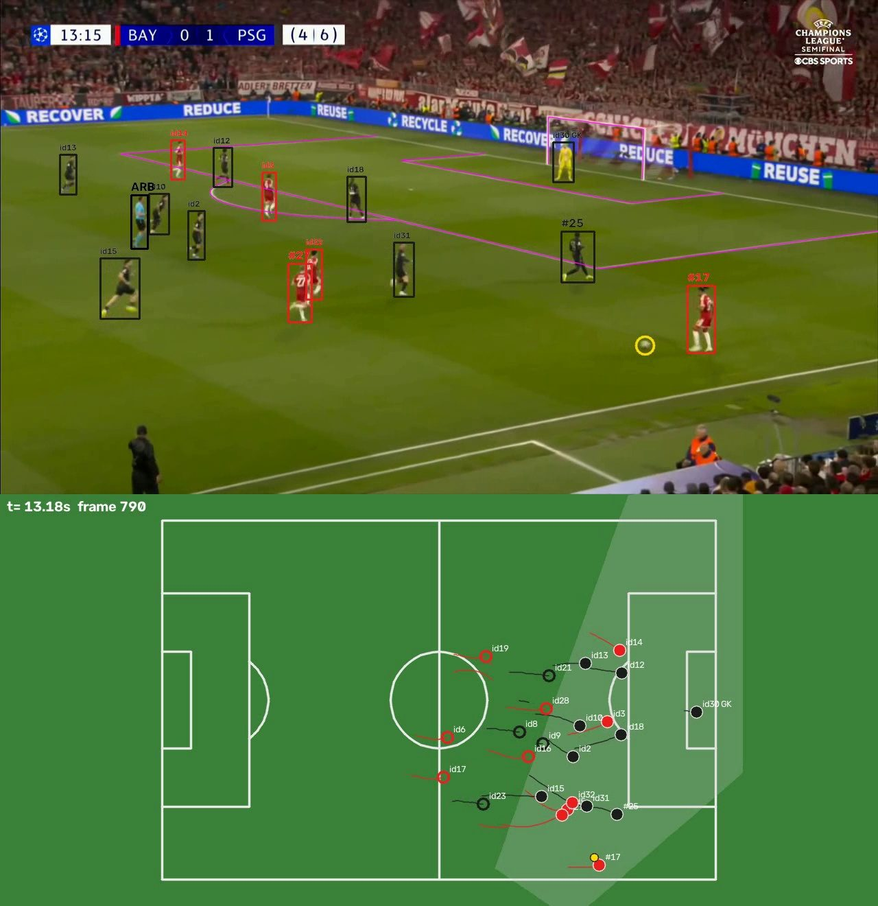
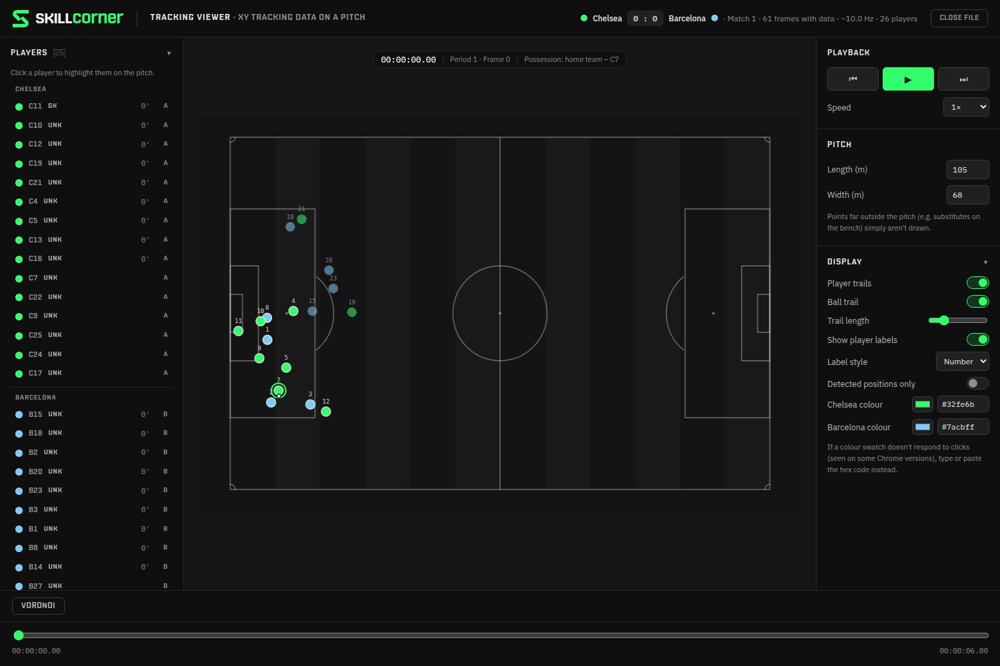

# soccercal — datos de tracking tipo SkillCorner a partir de un vídeo de retransmisión

Metes un vídeo de un partido (la cámara de televisión normal) y obtienes lo mismo que vende
SkillCorner: **la posición en metros de cada jugador y del balón 10 veces por segundo**, con
identidades, equipos, portero, el área que ve la cámara, jugadores fuera de plano extrapolados y
métricas físicas. Los archivos salen **en el formato exacto de SkillCorner**: se abren con su visor
oficial y con [kloppy](https://kloppy.pysport.org).

Funciona en **Google Colab** (gratis, con GPU), en **Jupyter** y en un **MacBook con Anaconda**
(usa la GPU del chip M mediante MPS).

Parte de la calibración del ganador de SoccerNet 2023
([sportlight baseline](https://github.com/NikolasEnt/soccernet-calibration-sportlight/tree/master/baseline)),
cuyos pesos nunca se publicaron: aquí se usan los pesos públicos de NBJW/PnLCalib (misma familia
HRNet, mismo vocabulario de 57 puntos del campo) sobre una implementación propia, y se añade todo lo
que hace falta para llegar a datos de tracking.

---

## Qué obtienes

`soccercal track partido.mp4 -o salida` crea en `salida/`:

| archivo | contenido |
|---|---|
| `1_tracking_extrapolated.jsonl` | **formato SkillCorner**: un fotograma cada 0,1 s con `player_data` (x, y, player_id, is_detected), `ball_data`, `possession`, `image_corners_projection` |
| `1_match.json` | **formato SkillCorner**: equipos, color de camiseta estimado, plantilla (identidades), portero, tamaño del campo |
| `tracking.csv` | lo mismo en tabla: `frame, timestamp, player_id, shirt_number, team, role, x, y, is_detected, speed_kmh` |
| `ball.csv` | el balón a 10 fps: `x, y, is_detected, kind` (`detected` visto, `interpolated` entre dos detecciones, `carried` en los pies de quien lo lleva) y la posesión |
| `physical.csv` | por jugador: distancia total y por bandas (andar, trotar, correr, HSR 20–25 km/h, sprint >25), velocidad máxima, PSV-99, nº de esfuerzos |
| `cameras.csv` | la cámara en cada fotograma: pan, inclinación, zoom, posición, calidad |
| `verificacion.mp4` | **el control de calidad**: el campo dibujado sobre la imagen + cada jugador con su identidad + minimapa |
| `summary.json` | resumen: % de fotogramas calibrados, identidades por equipo, calidad media |
| `analysis.pkl.gz` | la parte lenta ya calculada; si repites el comando se reutiliza (borra el archivo para rehacerla) |

Coordenadas como SkillCorner: metros, origen en el centro del campo, `x` a lo largo (positivo hacia la
derecha vista desde la cámara principal), `y` a lo ancho (positivo hacia la banda lejana).

### Cómo leer el vídeo de verificación

| lo que ves | significa |
|---|---|
| líneas magenta | el campo dibujado con la cámara calculada: deben caer encima de las líneas reales |
| `#17` | dorsal **leído en la camiseta** (OCR, votado sobre muchas lecturas) |
| `id12` | jugador cuyo dorsal todavía no se ha podido leer: es un número interno de seguimiento, **no** el dorsal |
| `GK`, `ARB`, `JL` | portero, árbitro, juez de línea (árbitros y jueces de línea no salen en los datos de jugadores) |
| sin caja | entrenadores, suplentes, recogepelotas y público: se detectan pero **no** son jugadores |
| círculo amarillo | balón detectado (en el minimapa: relleno = visto, hueco = interpolado o en los pies de quien lo lleva) |
| color de la caja | equipo según el color de la camiseta; un jugador **nunca** cambia de equipo a mitad de clip |
| aviso "PLANO DESCARTADO" | primer plano de un jugador/entrenador, público, banquillo, gráficos: ese tramo **no genera datos** |

Reglas (como SkillCorner): solo se usan planos abiertos de la cámara principal; un plano con una persona
que ocupa más del 40 % de la altura de la imagen, o con poco césped, se descarta. Una persona que pasa la
mayor parte del tiempo fuera de las líneas (banda, banquillo) es *staff*, nunca jugador, y el seguimiento
no puede unirla con un jugador. Un juez de línea es quien vive en la banda **y viste como el árbitro**;
alguien en la banda con otra ropa (entrenador con chaqueta negra, cuarto árbitro con abrigo, suplentes
calentando) es *staff* y no se dibuja.



*Arriba: campo dibujado a partir de la calibración (magenta) e identidades. Abajo: minimapa
(relleno = visto, hueco = extrapolado, gris = lo que ve la cámara).*



*La misma salida abierta en el visor oficial de SkillCorner (`SkillCorner/opendata/viz_tools`).*

---

## Opción 1 — Google Colab (lo más fácil, no instalas nada)

1. Abre <https://colab.research.google.com> → *Archivo → Abrir cuaderno → GitHub* y pega
   `https://github.com/delioguzmang-maker/tracking`. Elige `notebooks/00_empezar_aqui.ipynb`
   (si no aparece, cambia la rama a `claude/soccernet-calibration-pkg-r8517j`).
2. Menú *Entorno de ejecución → Cambiar tipo de entorno de ejecución → **GPU T4*** → Guardar.
3. *Entorno de ejecución → **Ejecutar todas***. La primera vez tarda unos 3 minutos (instala y descarga
   los modelos). Al final verás la verificación, las tablas y un zip para descargar.
4. Para tu vídeo: `notebooks/01_tu_partido.ipynb` (subida directa o desde Google Drive), o en el
   cuaderno 00 pon `SUBIR_MI_VIDEO = True`.

**¿Estoy usando la última versión?** La primera celda imprime por ejemplo
`soccercal 0.4.0 (código 1a2b3c4 2026-09-26 10:00) listo`. Cada vez que la ejecutas descarga lo último
(antes de la 0.4.0 no lo hacía: si ves `0.3.0`, abre el cuaderno de nuevo desde GitHub o haz
*Entorno de ejecución → Desconectar y eliminar entorno* y vuelve a ejecutar todo).

---

## Opción 2 — MacBook Pro con Anaconda, paso a paso

Todo se escribe en la app **Terminal** (Aplicaciones → Utilidades → Terminal). Copia cada bloque,
pégalo y pulsa Enter. Espera a que termine antes de pegar el siguiente.

**Paso 1. Instalar Miniconda** (si ya tienes Anaconda, salta al paso 2).
Descarga el instalador *macOS Apple Silicon (arm64) pkg* de
<https://www.anaconda.com/download/success> (sección Miniconda), ábrelo y sigue el asistente.
Cierra la Terminal y ábrela de nuevo. Debe aparecer `(base)` al principio de la línea.

**Paso 2. Descargar el código**

```bash
cd ~/Documents
git clone -b claude/soccernet-calibration-pkg-r8517j https://github.com/delioguzmang-maker/tracking.git
cd tracking
```

(Si `git` pide instalar las *herramientas de línea de comandos*, acepta y repite el comando.
Alternativa sin git: en GitHub, botón verde *Code → Download ZIP*, descomprímelo en Documentos y
haz `cd ~/Documents/tracking-*`.)

**Paso 3. Crear el entorno e instalar** (unos 5 minutos)

```bash
conda create -n soccercal python=3.11 -y
conda activate soccercal
pip install torch torchvision
pip install -e ".[notebooks,dev]"
```

**Paso 4. Comprobar la instalación**

```bash
soccercal doctor
```

Debe terminar en `Todo listo.` y mostrar `dispositivo = mps` (la GPU del Mac). La primera vez descarga
los pesos (~300 MB). Si algún paso dice `[FALLO]`, mira *Problemas frecuentes* abajo.

**Paso 5. Probar con el clip de ejemplo (6 segundos)**

```bash
soccercal track "$(soccercal sample)" -o salida_demo
open salida_demo/verificacion.mp4
```

Mira el vídeo: **las líneas magenta deben caer encima de las líneas del campo** y cada jugador debe
llevar un número que no cambia. Esa es la prueba de que todo funciona.

**Paso 6. Tu partido.** Empieza SIEMPRE por un tramo corto para ver si tu vídeo va bien:

```bash
soccercal track ~/Downloads/partido.mp4 -o salida_partido --max-seconds 60 --home-name "Local" --away-name "Visitante"
open salida_partido/verificacion.mp4
```

Si se ve bien, el partido entero (el doble de rápido con `--stride 2`, la salida sigue a 10 fps). Los
vídeos de 50/60 fps ya se analizan uno de cada dos fotogramas automáticamente; los fps se miden con las
marcas de tiempo reales del archivo, no con la cabecera, que a veces miente en clips recortados:

```bash
soccercal track ~/Downloads/partido.mp4 -o salida_partido --stride 2 --redo
```

**Paso 7. Jupyter (opcional).** `jupyter lab notebooks/` abre el navegador con los cuadernos
`00_empezar_aqui`, `01_tu_partido` y `02_analisis`.

**Cada vez que abras una Terminal nueva** tienes que hacer `conda activate soccercal` (y `cd` a la
carpeta si vas a usar rutas relativas). Es el error más común.

Desde Python:

```python
import soccercal
res = soccercal.run("partido.mp4", "salida", soccercal.Config(max_seconds=60))
res.table.head()          # posiciones a 10 fps
res.physical              # métricas físicas
```

### Tiempos orientativos

Medido aquí: CPU de 4 núcleos ≈ 1,2 s por fotograma (el clip de 6 s tarda ~3 min). En GPU el coste lo
dominan las dos redes (YOLO11m a 1280 px en cada fotograma analizado; la red del campo 1 de cada 5):
en una T4 de Colab o un Mac M1/M2 Pro espera del orden de 10 fotogramas por segundo, es decir
**unos 1–3 minutos por minuto de vídeo** a 25 fps, la mitad con `--stride 2`. Estas cifras de GPU
son estimaciones, no medidas en este repositorio. Más rápido: `--model yolo11s.pt`.

---

## Problemas frecuentes

| síntoma | solución |
|---|---|
| `command not found: soccercal` | no está activado el entorno: `conda activate soccercal` |
| `CERTIFICATE_VERIFY_FAILED` al descargar | ya se usa `certifi`; si persiste: `pip install --upgrade certifi` |
| `doctor` dice `dispositivo = cpu` en un Mac M | `pip install --upgrade torch torchvision` dentro del entorno |
| error de memoria (MPS / CUDA out of memory) | `--batch 2` |
| `pct_frames_with_camera` bajo | el vídeo tiene muchos primeros planos/repeticiones (se descartan a propósito) o no es la cámara principal |
| los equipos salen al revés | `--home-name` / `--away-name` en el orden contrario (el "local" es el primer grupo de color) |
| no se reproduce `verificacion.mp4` en el navegador | ábrelo con QuickTime o VLC (códec mp4v) |
| quieres rehacer el análisis con otro modelo | añade `--redo` |
| el balón se pierde a menudo | ver "El balón" más abajo: con un detector entrenado en fútbol mejora mucho |
| salen etiquetas `id12` en vez de dorsales | el dorsal no se ha visto con claridad (jugador siempre de frente o lejos); con más minutos de vídeo se leen más. Un número dudoso nunca se pone |
| en Colab no cambia nada tras una actualización | ejecuta de nuevo la primera celda y mira la línea `soccercal 0.4.0 (código …)` |

---

## Cómo funciona

```
vídeo ─► [pasada 1: redes, se guarda]  YOLO11 (personas + balón) en cada fotograma
                                       HRNet 57 puntos del campo cada 5 fotogramas
                                       registro del fondo entre fotogramas (flujo óptico)
                                       píxeles de las líneas blancas, color de camisetas
      ─► [pasada 2: segundos]          cámara en cada fotograma ─► jugadores en metros ─► seguimiento
                                       en el campo ─► re-identificación ─► equipos/portero ─► 10 fps
                                       + extrapolación fuera de cámara ─► métricas ─► formato SkillCorner
```

**Calibración (la base de todo).** Puntos clave del campo → homografía RANSAC → focal y pose
iniciales → refinamiento robusto con los puntos (incluidos los largueros a 2,44 m) **más miles de
restricciones densas**: cada línea pintada proyectada debe caer sobre píxeles blancos reales
(transformada de distancia). Luego, por plano, se fija la **posición de la cámara** (va en un trípode:
solo gira y hace zoom) y la calibración de cada fotograma se reduce a 4 parámetros. Entre
fotogramas, el movimiento del fondo da la rotación y el zoom con precisión sub-píxel (modelo de
4 parámetros, no una homografía libre de 8); un suavizador lo fusiona con las calibraciones absolutas.

**Seguimiento en el campo, no en la imagen.** Cada detección es un punto en metros con una
incertidumbre calculada (grande en profundidad para los jugadores lejanos). Filtro de Kalman por
jugador, asociación en dos etapas (estilo ByteTrack) con distancia de Mahalanobis + color de
camiseta, y suavizado RTS. La cámara puede girar lo que quiera: en el campo nadie "se mueve" por ello.
Los jugadores con los pies fuera de la imagen se sitúan por la cabeza (plano a 1,75 m).

**Re-identificación.** Cuando un jugador sale de plano y vuelve, se enlazan los tramos por
cinemática en metros: dónde y a qué velocidad salió, y cuánto se ha desplazado **su equipo** (medido
con los compañeros visibles) mientras no se le veía. Asignación óptima global y un veto de
ambigüedad: si hay dos continuaciones igual de plausibles no se enlaza, porque fusionar mal estropea
a dos jugadores y no fusionar solo parte a uno.

**Equipos, árbitro, portero.** Histograma de color de la camiseta normalizado por el color del
césped (corrige sombra/sol), agrupado en todo el vídeo; una equipación que se parte en dos grupos
(sol y sombra) se sigue reconociendo como el mismo equipo. Portero: la persona de color distinto que
vive junto a una portería; su equipo es el que tiene a sus defensas más cerca de esa portería.

**Segunda mirada (pasada 1b, solo donde falta algo).** Con el primer resultado ya se sabe dónde
buscar:
* *Balón*: en los fotogramas sin balón se vuelve a pasar el detector sobre un recorte alrededor de
  donde debería estar (interpolado entre las detecciones de antes y después), ampliado ~2,4×: un
  balón de 7 px pasa a 17 px. Sin pista cercana, se busca en toda la imagen por teselas.
* *Dorsales*: de cada jugador se eligen sus mejores vistas de todo el clip (las cajas más grandes, sin
  otro jugador delante) y se leen con dos métodos complementarios que vienen dentro del paquete (sin
  descargas): (1) localizar las cifras como manchas claras (u oscuras) que contrastan con el color
  de la camiseta y leer solo ese recorte; (2) detector de texto + reconocedor sobre la espalda
  ampliada y enfocada. Cada identidad vota con todas sus lecturas (un dígito necesita 3 votos, porque
  "7" suele ser medio "17"); un número dudoso no se pone. Dos fragmentos del mismo equipo y dorsal que
  nunca coinciden en pantalla se unen, y dorsales distintos impiden unir.

**Nunca más de 11 por equipo.** Si un equipo tiene más de 10 identidades de campo, algunas son el mismo
jugador visto otra vez: una asignación óptima une los fragmentos (cada tramo recibe un predecesor
posible físicamente, uno de los 10 "huecos" libres o, como último recurso, un hueco extra muy caro),
respetando dorsales y la incertidumbre de posición de los jugadores lejanos. Además, el seguimiento
nunca da a un jugador que ha mostrado la camiseta de un equipo una detección que viste claramente la
del otro: dos jugadores que se cruzan no se intercambian.

**Salida tipo SkillCorner.** Remuestreo a 10 fps; huecos cortos con curva de Hermite; jugadores
fuera de plano movidos con su equipo (`is_detected: false`); una posición extrapolada que la cámara
estaba viendo se descarta (si estuviera ahí, se habría detectado). El balón no visto se interpola
entre detecciones cercanas o se pone en los pies de quien lo lleva (hasta 2 s después de verlo en
sus pies, o 1,5 s antes de reaparecer en los pies de quien luego lo conserva).

---

## Precisión medida

**Calibración en vídeo real** (clip de 6 s, 153 fotogramas, sin verdad de campo: se mide cuánto del
dibujo del campo cae sobre las líneas blancas de la imagen y cuánto vibra la cámara estimada entre
fotogramas; `python tools/calibration_benchmark.py`):

| variante | calibrados | alineación ≤3 px | ≤1 px | vibración pan (°) | inclinación (°) | giro (°) | zoom (log) |
|---|---|---|---|---|---|---|---|
| A. puntos clave fotograma a fotograma (como el baseline / NBJW) | 153/153 | 0,759 | 0,574 | 0,174 | 0,110 | 0,128 | 0,0240 |
| B. + refinamiento denso con las líneas | 153/153 | 0,785 | 0,628 | 0,159 | 0,058 | 0,048 | 0,0199 |
| C. + trípode (posición de cámara fija) | 153/153 | 0,788 | 0,625 | 0,028 | 0,005 | 0,038 | 0,0026 |
| **D. final: red 1 de cada 5 fotogramas + registro + fusión** | 153/153 | **0,788** | **0,633** | **0,014** | **0,003** | **0,004** | **0,0004** |

La versión final dibuja el campo más pegado a las líneas reales y **vibra entre 12 y 60 veces
menos** que calibrar cada fotograma por separado, ejecutando la red del campo 5 veces menos. La
vibración es lo que destroza las velocidades: 0,1° de error en la cámara son decenas de centímetros
en la banda lejana. (La alineación no llega a 1 porque los jugadores y la pintura gastada tapan
parte de las líneas.) Además: decodificar los mapas de calor con el desfase correcto
(etiqueta = `floor(x/2)`) subió la alineación de 0,68 a 0,76 por sí solo.

**Seguimiento con verdad conocida** (`python tools/synthetic_benchmark.py`): trayectorias reales de
22 jugadores (datos abiertos de Metrica Sports) vistas por una cámara simulada que sigue el balón con
paneos y zoom; detecciones con ruido, fallos, oclusiones y falsos positivos; 3 tramos de 1 minuto.

| métrica | resultado |
|---|---|
| pureza de identidad (observaciones asignadas a la persona correcta) | **99,7 %** |
| IDF1 | 0,81 |
| identidades por jugador real en 1 minuto | 2,0 (se fragmenta en vez de mezclar) |
| error de posición, jugadores vistos (calibración perfecta) | 5 cm mediana, 12 cm p90 |
| error de posición, jugadores extrapolados fuera de cámara | 3,8 m mediana, 11,7 m p90 |
| con un error de calibración lento de 0,1° | identidades igual (pureza 99,7 %); posición 21 cm mediana, 50 cm p90 |

El mismo banco sirvió para corregir el diseño: la primera versión (enlace voraz sin compensar el
movimiento del equipo) asignaba mal el 6 % de las observaciones; la actual, el 0,3 %. La
extrapolación siguiendo al equipo bajó el error fuera de cámara de 6,1 m a 3,8 m.

**Balón**, en los fotogramas de salida (10 fps) con cámara válida:

| clip | posición conocida | detectado directamente | muestra revisada a ojo |
|---|---|---|---|
| clip de 1080p, 6 s | **77 %** | 49 % | 48 de 48 posiciones eran el balón real |
| Bayern–PSG original, 720p, 14 s | **70 %** | 41 % | 48 de 48 posiciones eran el balón real |

El resto está interpolado entre detecciones o en los pies del jugador que lo lleva. Antes de los filtros,
en el Bayern–PSG el "balón" elegido era casi siempre la bota flúor de un jugador.

**Bayern–PSG original** (vídeo de la semifinal, 720p, 59,94 fps aunque la cabecera del archivo dice
52,2: los fps se miden con las marcas de tiempo reales):

* El plano del palco del inicio (6,6 % de los fotogramas) se descarta entero.
* Los dos entrenadores de negro junto a la banda son *staff*: no se dibujan ni salen en los datos.
* El árbitro sale una sola vez, aunque tapado por jugadores lo detectan dos cajas.
* El portero del PSG se asigna al PSG.
* Dorsales leídos: #17 y #27 del Bayern y #25 del PSG.
* La calibración cae sobre las líneas reales en todo el clip (círculo central, área, portería).

Formato verificado: `tests/test_export.py` carga la salida con kloppy, y el visor oficial
`SkillCorner_Tracking_Viewer.html` la abre sin errores (probado en Chromium: 26 identidades, 61 fotogramas, 10 Hz, portero y posesión).

---

## En qué se parece a SkillCorner y en qué no (honestamente)

Igual: formato de archivos, sistema de coordenadas, 10 fps, `is_detected`, extrapolación fuera de
cámara, proyección de las esquinas de la imagen, posesión, métricas físicas, descarte de planos que
no son la cámara principal.

Diferente / pendiente:

* **Identidades y dorsales.** SkillCorner conoce la alineación, reconoce dorsales y revisa a mano
  (anuncian ~97 % de identidades correctas). Aquí los dorsales se leen con OCR cuando la espalda del
  jugador es visible y está cerca de la cámara (en el clip de prueba a 720p: 3 de 22 jugadores en 14 s;
  en un partido completo y a 1080p se leen muchos más). Un jugador sin dorsal leído que sale mucho rato
  de plano puede volver con otro `id`: habrá más identidades que jugadores. Con dorsal, los fragmentos se
  unen automáticamente.
* **El balón.** El detector genérico (COCO) ve el balón con poca confianza y confunde botas blancas o
  flúor, cabezas y letras de las vallas. Por eso: se guardan también las detecciones débiles, se exige
  que el candidato esté en el césped, tenga el tamaño de un balón de 22 cm a esa distancia, no esté
  sobre un jugador y no sea de un color saturado, y se elige la trayectoria que se mueve como un balón
  (las botas y los falsos positivos saltan). Un candidato pegado al pie puede ser el balón conducido o
  una bota blanca: solo sirve para unir dos detecciones limpias de la misma trayectoria (una
  conducción), nunca para empezarla. Cuando el balón no se ve pero un jugador lo tiene, se sitúa
  en sus pies (`is_detected: false`). La altura (`z`) no se estima. **Para mejorarlo de verdad** usa un
  detector entrenado en fútbol: `--model ruta/a/modelo_futbol.pt` (cualquier modelo Ultralytics cuyas
  clases se llamen `player`, `goalkeeper`, `referee`, `ball`; se reconocen automáticamente).
* **Repeticiones a cámara lenta desde la cámara principal:** no se detectan (las de otras cámaras sí
  se descartan porque la cámara está en otra posición).
* **Distorsión de lente:** se asume cero (correcto en la cámara principal; no en objetivos gran
  angular).
* La pasada de redes en CPU es lenta; para partidos completos usa GPU (Colab) o el Mac con MPS.

---

## Para desarrolladores

```bash
pytest -q                                  # 35 pruebas, ~30 s, no necesitan pesos
python tools/synthetic_benchmark.py        # seguimiento con verdad conocida
python tools/calibration_benchmark.py      # calibración en el clip real
python tools/make_notebooks.py             # regenera los cuadernos
```

Código en `soccercal/`: `hrnet.py` (red), `field_model.py` (puntos del campo), `camera.py` /
`calibrate.py` / `lines.py` (calibración), `camtrack.py` / `cameras.py` (cámara en el tiempo),
`detect.py`, `tracker.py`, `stitch.py`, `teams.py`, `players.py` (jugadores), `timeline.py`,
`ball.py`, `physical.py`, `skillcorner.py` (salida), `viz.py`, `pipeline.py`, `cli.py`.

## Créditos y licencias

* Pesos HRNet: *No Bells, Just Whistles* / *PnLCalib* (M. Gutiérrez-Pérez y A. Agudo), descargados
  en tiempo de ejecución desde sus publicaciones de GitHub; consulta su licencia (GPL-2.0) antes de un
  uso comercial. La arquitectura de `hrnet.py` está escrita desde el artículo de HRNet, no copiada.
* Detector: Ultralytics YOLO11 (AGPL-3.0).
* Clip de ejemplo: repositorio de NBJW. Trayectorias del banco sintético: Metrica Sports sample data.
* Formato y visor: SkillCorner open data.
